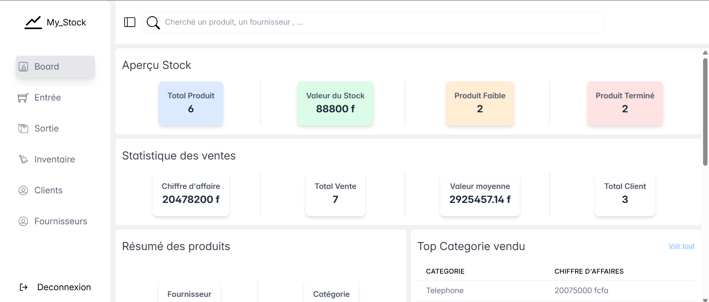

# Gestion de stock - Mystock

Ce projet vise à aider un jour mon frère a géré son entreprise

## Table des matières

- [Overview](#overview)
  - [Ce que l'utilisateur peut faire](#utilisateurs)
  - [Capture d'ecran](#Captured'ecran)
  - [Liens](#Liens)
- [Mon Processus](#my-process)

  - [Construit avec](#Construit avec)

- [Auteur](#Auteur)

## Aperçu

### Ce que l'utilisateur peut faire

Les utilisateurs sont en mesure de:

- Avoir une vue optimal de tout les données dans la base de donnée
- Cree un compte utilisateur
- Un tableau de bord recaputulatif de tout les données
- Interragir avec la liste des produits ( Voir/Modifier/Supprimer)
- Interragir avec la liste des Clients ( Voir/Modifier/Supprimer)
- Interragir avec la liste des fournisseurs ( Voir/Modifier/Supprimer)
- Interragir avec la liste des des entrés de produit ( Voir/Modifier/Supprimer)
- Interragir avec la liste des des sorties de produit ( Voir/Modifier/Supprimer)

### Capture d'ecran

### Liens

- Solution URL: [Solution url](https://github.com/Moulaye-dagnon/gestion_de_stock)

## Mon Processus

### Construit avec 
#### Frontend

- Mobile-first workflow
- [React](https://reactjs.org/) - JS library
- [React Router ](https://reactrouter.com/home) - For SPA
- [Tanstack Query ](https://tanstack.com/query/latest/docs/framework/react/overview) - Fetching and caching data
- [Tanstack table](https://tanstack.com/table/latest/docs/introduction)- Headless UI library for building table
- [Tailwindcss](https://tailwindcss.com/) - For styles
- .....

#### Backend

- Mobile-first workflow
- [Node.JS](https://nodejs.org/fr) - un environnement d'exécution JavaScript coté serveur
- [Express.Js ](https://expressjs.com/) - Framework Node.js
- [mysql2](https://sidorares.github.io/node-mysql2/docs)- Pour interragir avec une Bdd sql
- .....

## Auteur

- Frontend Mentor - [@Moulaye-dagnon](https://www.frontendmentor.io/profile/Moulaye-dagnon)
- Linkedin - [@moulaye-amadou-dagnon](https://www.linkedin.com/in/moulaye-amadou-dagnon-07a224292/)
